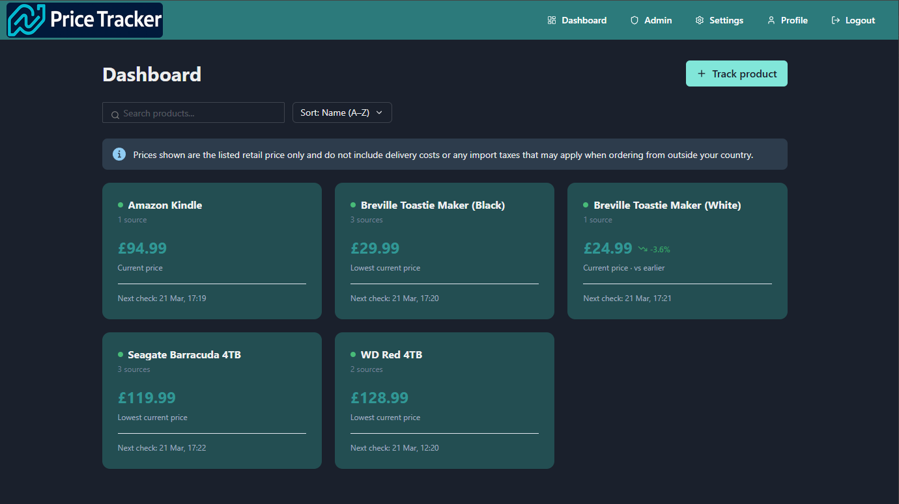
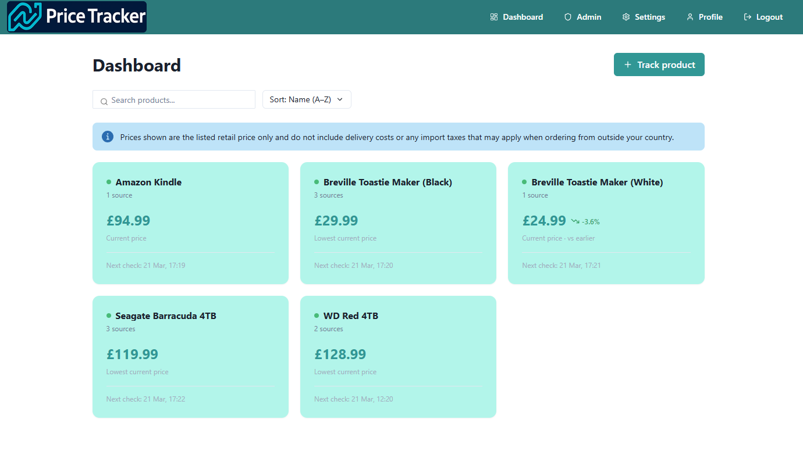
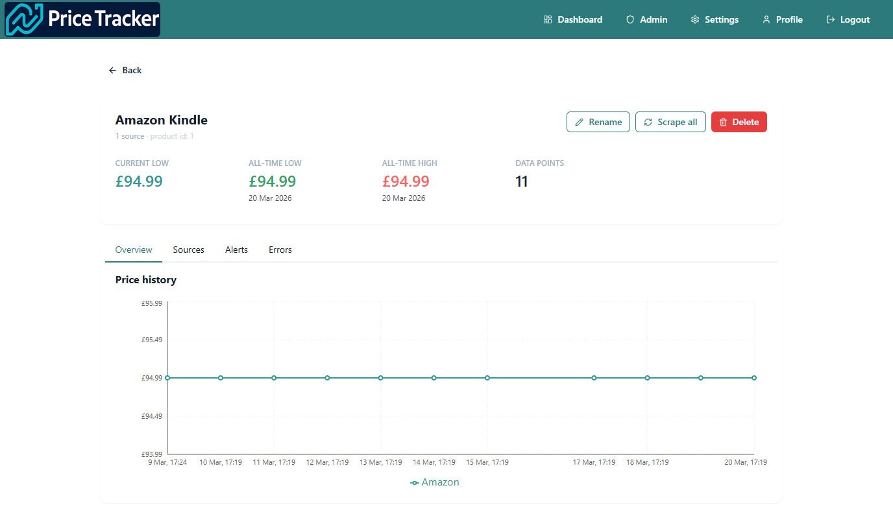
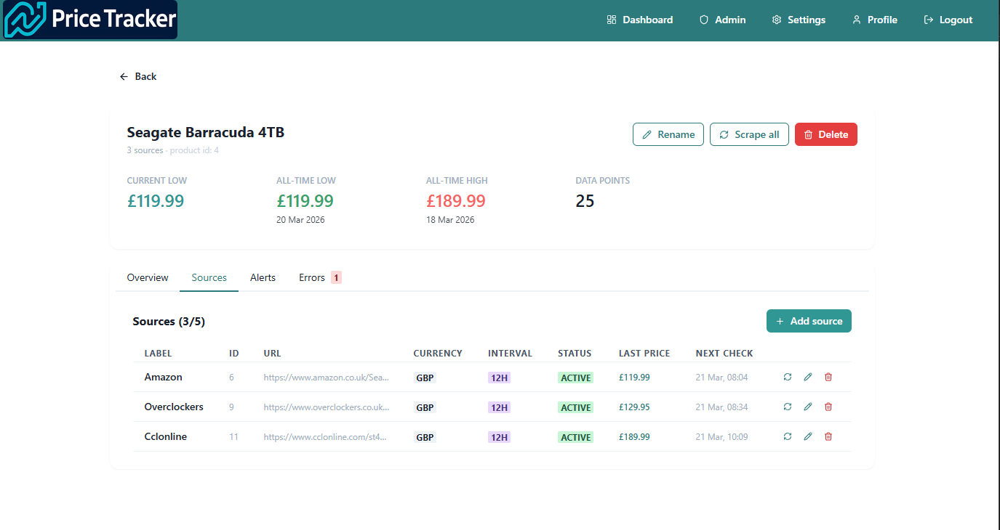
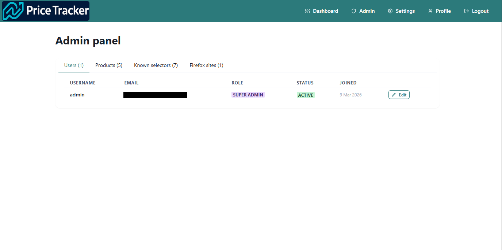
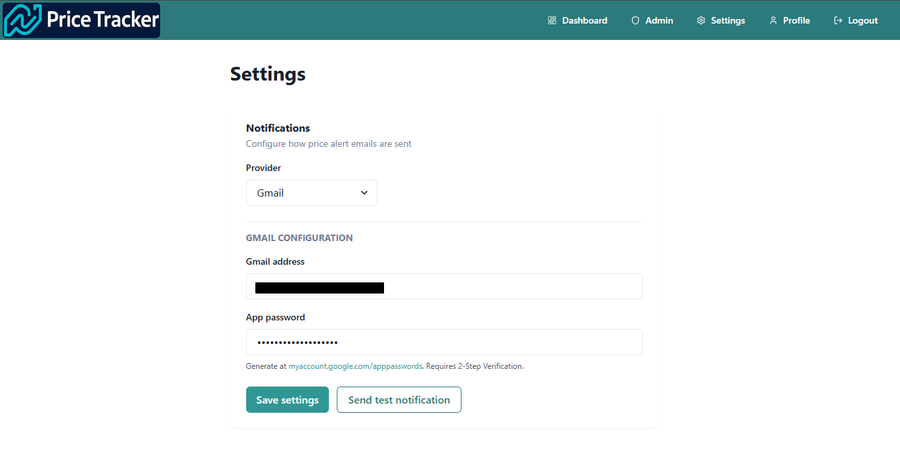
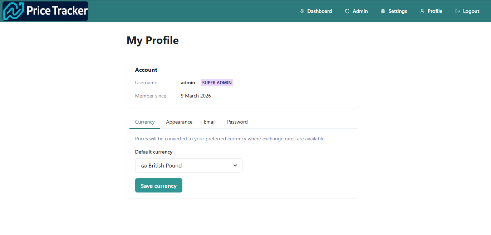

# 📈 Price Tracker

A self-hosted price tracking application that monitors product prices over time and displays historical trends. Built with FastAPI, React, PostgreSQL, and Playwright.

    

---

## Screenshots

### Dashboard (light mode)


### Dashboard (dark mode)


### Product detail — price history


### Product detail — sources


### Admin panel


### Settings


### Profile


---

## Features

- **Track any product URL** — add a product and attach up to 5 sources (URLs) from different retailers
- **Multi-source price comparison** — compare prices across retailers on a single graph, each source shown as its own coloured line
- **Scheduled scraping** — each source has its own configurable check interval (15 minutes to 24 hours)
- **Persistent scheduler** — scrape schedules survive backend restarts and maintain their original timing
- **Auto-retry failed scrapes** — failed scrapes are automatically retried after 30 seconds before logging an error
- **Known selectors** — CSS selectors for popular retailers are stored in the database and auto-applied when adding new sources
- **Multi-currency support** — set a default currency per user; prices are automatically converted using daily exchange rates
- **Price history graphs** — time-scaled graphs showing price trends across all sources, displayed in the user's preferred currency
- **Price change indicators** — dashboard cards show week-over-week price change with green/red trend arrows
- **Dashboard sorting and filtering** — sort by name, price, last scraped, or biggest price drop; filter by name
- **Price alerts** — get email and browser push notifications when a price drops below a target, hits a new all-time low, or decreases since the last check
- **In-app messaging** — price alerts can optionally send in-app messages; admins can broadcast messages to individual users or all users
- **Browser push notifications** — receive alerts even when the app is not open, via the Web Push API
- **Dark mode** — user-configurable dark mode saved to their account
- **Tabbed UI** — product detail, admin panel, and profile pages use tabs for a cleaner layout
- **User profiles** — tabbed interface for managing currency, email, password, appearance, and push notifications
- **Multi-user support** — each user has their own tracked products and price history
- **Admin panel** — tabbed interface for managing users, products, known selectors, Firefox sites, and broadcasts
- **Price history management** — admins can delete individual spurious scrape results
- **Super admin** — dedicated role with access to system settings, notification configuration, VAPID key management, and scraper management
- **Configurable notifications** — choose between Gmail and SMTP for alert emails, configured via the settings page
- **Manual scrape trigger** — scrape any product or individual source on demand
- **Error tracking** — failed scrapes shown on the Errors tab of each product page
- **Session expiry handling** — automatic redirect to login with a clear message when session expires
- **Type checking** — mypy runs on every backend build to catch type errors before deployment

---

## Stack

| Layer | Technology |
|---|---|
| Frontend | React 18, Vite, Chakra UI, Recharts, React Query |
| Backend | Python 3.12, FastAPI, APScheduler |
| Scraping | Playwright (Chromium + Firefox fallback for bot-protected sites) |
| Database | PostgreSQL 16 |
| Auth | JWT (python-jose) + bcrypt |
| Notifications | Gmail SMTP or any SMTP server + Web Push (VAPID) |
| Exchange rates | Frankfurter API (ECB data, free, no API key) |
| Type checking | mypy |
| Infrastructure | Docker Compose, Nginx |

---

## Getting Started

### Prerequisites

- [Docker](https://docs.docker.com/get-docker/) and [Docker Compose](https://docs.docker.com/compose/install/)
- Git

### Installation

1. **Clone the repository**
```bash
git clone https://github.com/devoidx/price-tracker.git
cd price-tracker
```

2. **Create your `.env` file**
```bash
cp .env.example .env
```

Generate a secure secret key and add it to `.env`:
```bash
python3 -c "import secrets; print(secrets.token_hex(32))"
```

Your `.env` should look like:
```
SECRET_KEY=your-generated-secret-key-here
```

3. **Build and start the application**
```bash
docker compose up --build
```

The first build takes a few minutes as it downloads Playwright, Chromium, and Firefox.

4. **Access the app**

| Service | URL |
|---|---|
| Frontend | http://localhost:3000 |
| API docs | http://localhost:8000/docs |

> The frontend port can be changed in `docker-compose.yml` if 3000 is already in use on your machine.

5. **Log in with the default admin account**

| Field | Value |
|---|---|
| Username | `admin` |
| Password | `changeme` |

> ⚠️ Change the admin password immediately after first login via the **Profile** page.

6. **Configure notifications**

Go to **Settings** (visible in the navbar for super admins) and configure your email provider. Update the admin email address so alerts can be delivered:
```bash
docker compose exec db psql -U tracker -d pricetracker -c "UPDATE users SET email = 'your@email.com' WHERE username = 'admin';"
```

### Migrating an existing deployment

If you are upgrading from a previous version, run the migration script to add the messages table:
```bash
sudo docker compose exec db psql -U tracker -d pricetracker -f /docker-entrypoint-initdb.d/migrate_add_messages.sql
```

Or apply it manually:
```bash
sudo docker compose exec db psql -U tracker -d pricetracker -c "$(cat backend/db/migrate_add_messages.sql)"
```

---

## User Roles

| Role | Permissions |
|---|---|
| User | Track products, manage own alerts, read messages, update own profile |
| Admin | All user permissions + manage users, view all products and scrape errors, view known selectors and Firefox sites, delete spurious price history entries, broadcast messages to users |
| Super admin | All admin permissions + access settings page, configure notifications, manage VAPID keys for push notifications, manage known selectors and Firefox sites, grant super admin to others |

The default `admin` account is a super admin. Additional super admins can be promoted via the Admin panel.

---

## Usage

### Adding a product

1. Click **Track product** on the dashboard
2. Enter a product name (e.g. "PS5 Controller")
3. Click the product card to open the detail page
4. In the **Sources** tab, click **Add source** to add a retailer URL

### Adding sources

Each product can have up to 5 sources. For each source:

1. Enter the retailer URL
2. Optionally enter a label (e.g. "Amazon") — auto-generated from the URL if left blank
3. Optionally enter a CSS selector — auto-applied from the known selectors database if the domain is recognised
4. Select the currency — auto-detected from the URL domain
5. Choose how often to check the price

### Product detail page

The product detail page is organised into tabs:

| Tab | Contents |
|---|---|
| Overview | Price history graph and stats (current low, all-time low/high, data points) |
| Sources | Manage retailer URLs, selectors, intervals, and currencies |
| Alerts | Set up and manage price alert notifications |
| Errors | Recent scrape errors with source and timestamp (only shown when errors exist) |
| History | Full paginated scrape history with delete button for admins |

### In-app messaging

Users receive in-app messages in their **Messages** inbox, accessible from the navbar. An unread badge shows the number of unread messages and updates every 60 seconds.

Messages can be sent in two ways:

**Price alert messages** — when setting up or editing an alert, enable the **Send in-app message** toggle. When the alert triggers, an in-app message is sent to the user's inbox in addition to any email or push notification.

**Admin broadcasts** — admins can send messages to individual users or all users at once via the **Broadcast** tab in the Admin panel. This is useful for system announcements, maintenance notices, or important updates.

### Known selectors

When adding a source for a recognised retailer, the CSS selector is automatically applied from the known selectors database. If a source has no explicit selector, the scraper tries all known selectors for that domain before falling back to auto-detection.

### Finding a CSS selector

If a site isn't in the known selectors database:

1. Right-click the price on the product page
2. Click **Inspect**
3. Look at the highlighted element — note its tag and class names
4. Build a selector from the class, e.g. `.price__amount` or `.fw-bold.h4`

Use `GET /prices/source/{source_id}/debug` in the API docs to inspect what the scraper sees. Source IDs are visible in the Sources tab for super admins.

Once you find a working selector, add it to the known selectors database via the Admin panel.

### Known working selectors

| Site | Selector | Notes |
|---|---|---|
| Amazon UK | `.a-offscreen` | |
| Currys | `.prod-price` | |
| Argos | `h2` | Uses Firefox |
| eBay | `.x-price-primary` | |
| Overclockers | `.price__amount` | |
| Gadgetverse | `.hM4gpp span` | |
| CCL Computers | `.fw-bold.h4` | |
| Pet Drugs Online | `.price-regular` | |
| John Lewis | — | ❌ Blocked |
| CPC/Farnell | — | ❌ Blocked |

### Scraper compatibility

The scraper uses Chromium by default. For sites that block Chromium, Firefox is used automatically. Firefox sites are managed in the Admin panel under the **Firefox sites** tab — no code changes required. Failed scrapes are automatically retried once after 30 seconds before logging an error.

### Multi-currency support

Set your preferred currency in **Profile → Currency**. Prices are automatically converted using daily exchange rates fetched from the European Central Bank via the Frankfurter API. The graph, stats, and dashboard cards all display prices in your preferred currency.

Supported currencies: GBP, USD, EUR, JPY, CAD, AUD, CHF, SEK, NOK, DKK.

Currency is also set per source — auto-detected from the URL domain (e.g. `.co.uk` → GBP, `.com` → USD).

### Price change indicators

Dashboard cards show a green arrow and percentage when a price has dropped, or a red arrow when it has risen, compared to the price from 7 days ago.

### Setting up alerts

On any product detail page, go to the **Alerts** tab and click **Add alert**. Three alert types are available:

| Alert type | Description |
|---|---|
| Price drops below a threshold | Notifies you when the price falls below a specific amount you set |
| New all-time low | Notifies you when the product hits its lowest ever recorded price |
| Any price decrease | Notifies you whenever the price drops compared to the previous scrape |

Each alert can independently send email, browser push notifications, and in-app messages. Alerts are evaluated across all sources for a product — if any source hits the condition, you'll be notified.

### Browser push notifications

Push notifications allow you to receive price alerts even when the app is not open.

**Setup (super admin):**
1. Go to **Settings → Browser push notifications**
2. Enter a contact email address
3. Click **Generate keys**
4. Click **Save settings**

**Enable (per user):**
1. Go to **Profile → Notifications**
2. Toggle **Push notifications** on
3. Grant browser permission when prompted

> ⚠️ Push notifications require HTTPS. They will not work over plain HTTP on a local network. See the HTTPS section below.

### Dark mode

Go to **Profile → Appearance** and toggle between light and dark mode. The preference is saved to your account and applies across all devices.

### Running in the background
```bash
docker compose up -d
```

### Viewing logs
```bash
docker compose logs -f backend
```

---

## Notification Settings

Notification settings are configured via the **Settings** page, accessible to super admins from the navbar.

### Gmail

1. Enable 2-Step Verification at [myaccount.google.com/security](https://myaccount.google.com/security)
2. Generate an app password at [myaccount.google.com/apppasswords](https://myaccount.google.com/apppasswords)
3. In Settings, select **Gmail** as the provider
4. Enter your Gmail address and the 16-character app password
5. Click **Save settings** then **Send test notification** to verify

### SMTP

In Settings, select **SMTP** as the provider and enter:

| Field | Description |
|---|---|
| Host | Your SMTP server hostname |
| Port | Usually 465 (SSL) or 587 (STARTTLS) |
| Username | Your SMTP username |
| Password | Your SMTP password |
| From address | The address emails will be sent from |
| Use TLS | Enable for SSL/STARTTLS connections |

---

## HTTPS

Browser push notifications and service workers require HTTPS. For homelab use, the recommended approach is to use a reverse proxy with a trusted certificate.

**Nginx Proxy Manager with mkcert (local network):**

1. Generate a local CA and wildcard certificate:
```bash
mkcert -install
mkcert "*.yourdomain.local" yourdomain.local
```
2. Import the `rootCA.pem` from `mkcert -CAROOT` into your OS trust store
3. Upload the generated certificate to Nginx Proxy Manager
4. Create a proxy host pointing to port 3001

> Note: Chrome 127+ uses its own root store and may not trust locally installed CAs. Cloudflare Tunnel is recommended for full push notification support.

**Cloudflare Tunnel (recommended):**
Free, no port forwarding required, provides a globally trusted HTTPS certificate that works in all browsers including Chrome.

---

## Admin Panel

The admin panel is organised into tabs:

| Tab | Contents |
|---|---|
| Users | View all users, edit details, manage roles, deactivate accounts |
| Products | View all tracked products across all users, expand to see scrape errors |
| Known selectors | View and manage CSS selectors for known retailers |
| Firefox sites | View and manage sites that require Firefox for scraping |
| Broadcast | Send messages to individual users or all users at once |

---

## Resetting the Admin Password

Generate a fresh hash:
```bash
sudo docker compose exec backend python3 -c "from passlib.context import CryptContext; ctx = CryptContext(schemes=['bcrypt'], deprecated='auto'); print(ctx.hash('yourpassword'))"
```

Then update it directly in psql:
```bash
sudo docker compose exec db psql -U tracker -d pricetracker
```
```sql
UPDATE users SET password_hash = 'paste-hash-here' WHERE username = 'admin';
\q
```

---

## Customisation

### Changing the colour scheme

The theme is defined in `frontend/src/main.jsx`. Update the `brand` colour object:
```javascript
const theme = extendTheme({
  colors: {
    brand: {
      50:  '#e6fffa',
      100: '#b2f5ea',
      500: '#319795',
      600: '#2c7a7b',
      700: '#285e61',
    }
  }
})
```

Generate a full palette at [tints.dev](https://www.tints.dev).

### Changing the logo

Place your image in `frontend/public/` and update `frontend/src/components/Navbar.jsx`:
```jsx

```

After any frontend changes, rebuild:
```bash
docker compose up --build -d frontend
```

---

## Accessing from other devices on your network
```bash
ip addr show | grep "inet " | grep -v 127.0.0.1
```

Then visit `http://<your-ip>:3001` from any device on your network.

---

## Development
```bash
# Start all services
docker compose up

# Rebuild a specific service
docker compose up --build backend

# Open a shell in the backend container
docker compose exec backend bash

# Connect to the database
docker compose exec db psql -U tracker -d pricetracker

# Run mypy type checking manually
docker compose exec backend python -m mypy . --ignore-missing-imports --exclude '__pycache__'

# Wipe the database and start fresh (caution — deletes all data)
docker compose down -v
docker compose up
```

---

## Project Structure
```
price-tracker/
├── docker-compose.yml
├── .env
├── .env.example
├── screenshots/
├── frontend/
│   ├── Dockerfile
│   ├── nginx.conf
│   └── src/
│       ├── main.jsx              # App entry point + Chakra theme
│       ├── App.jsx               # Routes + auth guards
│       ├── index.css             # Minimal global styles
│       ├── api.js                # All API calls
│       ├── context/
│       │   └── AuthContext.jsx   # Auth state + colour mode sync
│       ├── components/
│       │   ├── Navbar.jsx        # Navigation + unread message badge
│       │   ├── ProductCard.jsx
│       │   ├── AddProductModal.jsx
│       │   ├── ComposeModal.jsx  # Message compose modal
│       │   ├── SourcesPanel.jsx
│       │   ├── AlertsPanel.jsx   # Includes in-app message toggle
│       │   └── PriceChart.jsx
│       └── pages/
│           ├── Login.jsx
│           ├── Register.jsx
│           ├── Dashboard.jsx
│           ├── ProductDetail.jsx
│           ├── Messages.jsx      # User message inbox
│           ├── Profile.jsx
│           ├── Admin.jsx         # Includes Broadcast tab
│           └── Settings.jsx
└── backend/
    ├── Dockerfile
    ├── mypy.ini
    ├── requirements.txt
    ├── main.py                   # App entry point + scheduler startup
    ├── database.py               # DB connection
    ├── models.py                 # SQLAlchemy models
    ├── schemas.py                # Pydantic schemas
    ├── auth.py                   # JWT + password hashing
    ├── scraper.py                # Playwright scraper (Chromium + Firefox, auto-retry)
    ├── scheduler.py              # APScheduler jobs (persisted to PostgreSQL)
    ├── notifications.py          # Email/notification providers
    ├── alerts.py                 # Alert checking logic + in-app message trigger
    ├── currencies.py             # Exchange rates and currency conversion
    ├── push_notifications.py     # Web Push / VAPID notifications
    ├── db/
    │   ├── init.sql              # Database schema + seed data
    │   └── migrate_add_messages.sql  # Migration for existing deployments
    └── routers/
        ├── users.py              # Register, login, /me, password/currency/colour mode
        ├── products.py           # Product + source CRUD + scheduler
        ├── prices.py             # Price history + scrape triggers + debug + delete
        ├── alerts.py             # Alert CRUD + test email + in-app message toggle
        ├── messages.py           # Message inbox, compose, broadcast, mark read
        ├── admin.py              # User and product management
        ├── settings.py           # System settings (super admin only)
        ├── selectors.py          # Known selectors CRUD
        ├── firefox_sites.py      # Firefox sites CRUD
        └── push.py               # Push subscription management
```

---

## Troubleshooting

**Price not found automatically** — the domain may not be in the known selectors database. Add a CSS selector manually, verify it works, then add it to the known selectors via the Admin panel. Use `GET /prices/source/{source_id}/debug` in the API docs to inspect what the scraper sees. Source IDs are shown in the Sources tab for super admins.

**Selector found but price won't parse** — the selector may be returning extra text. Use the debug endpoint to see exactly what text is being returned and try a more specific selector.

**Site returns 403 or Access Denied** — the site is blocking the scraper. Add the domain to the Firefox sites list in the Admin panel. If Firefox also fails, the site may require a paid proxy service.

**Exchange rates not updating** — check logs with `docker compose logs backend | grep -i "exchange rate"`. Rates are fetched on startup and every 24 hours via the Frankfurter API.

**Push notifications not working** — push notifications require HTTPS with a trusted certificate. They will not work over plain HTTP or with self-signed certificates on Chrome 127+. Use Cloudflare Tunnel or a properly trusted certificate. Also ensure VAPID keys have been generated in Settings.

**Scheduler not firing** — check logs with `docker compose logs backend | grep -i "schedul\|❌\|⚠️"`. Make sure `--reload` is not in the backend Dockerfile CMD.

**Alert emails not arriving** — go to Settings and use **Send test notification** to verify your configuration. Check logs with `docker compose logs backend | grep -i "email\|smtp\|gmail"`.

**Messages not appearing** — check that the messages table exists in the database. If upgrading from an older version, run the migration script in `backend/db/migrate_add_messages.sql`.

**Session expired** — if you see "Your session has expired" on the login page, your JWT token has expired. Log in again to continue.

**Default admin login fails** — generate a fresh hash and update via psql as described in the Resetting the Admin Password section.

**Frontend showing stale UI after rebuild** — hard refresh with `Ctrl + Shift + R` or open in a private/incognito window.

---

## Disclaimer

Prices shown are the listed retail price only and do not include delivery costs or any import taxes that may apply when ordering from outside your country.

---

## Contributing

Pull requests are welcome. For major changes, please open an issue first.

---

## License

[MIT](LICENSE)